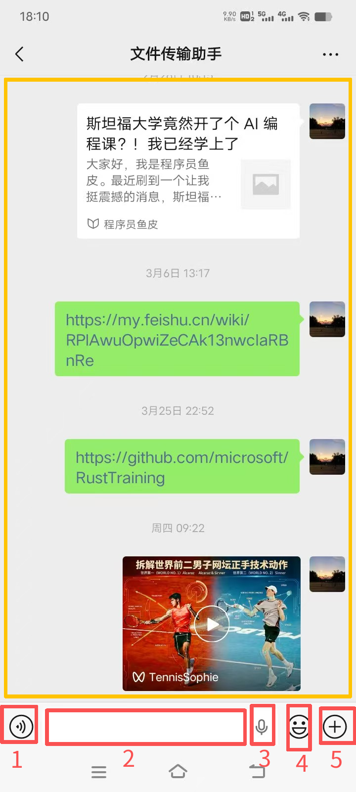
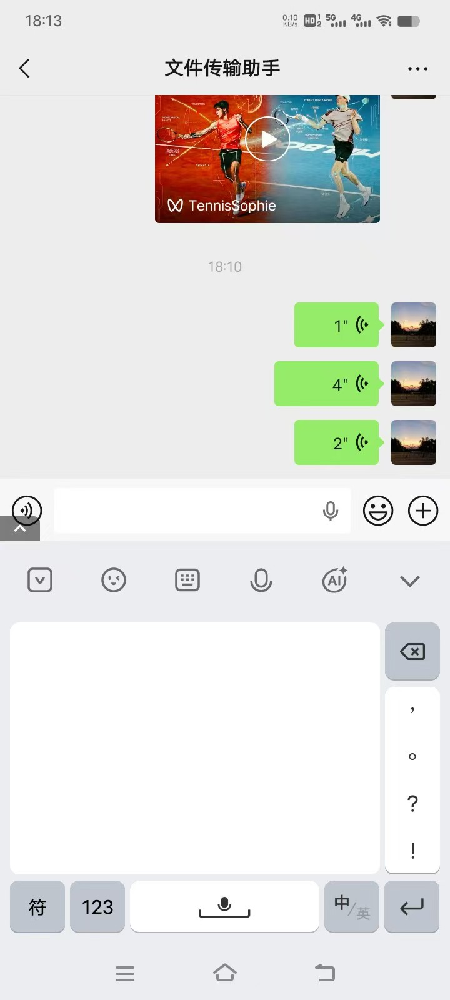
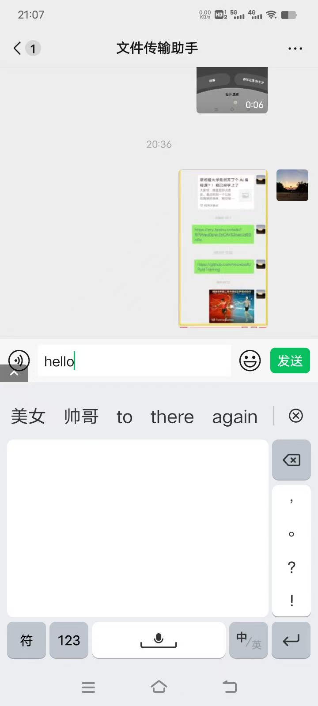
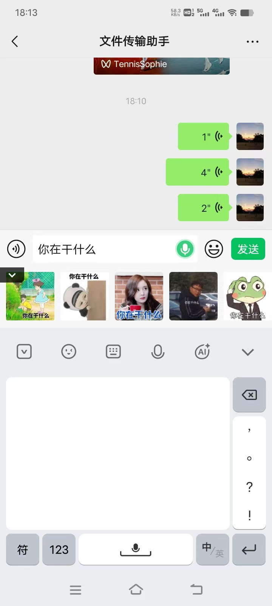
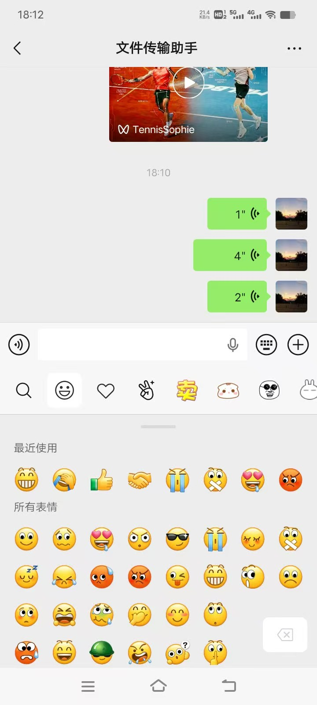
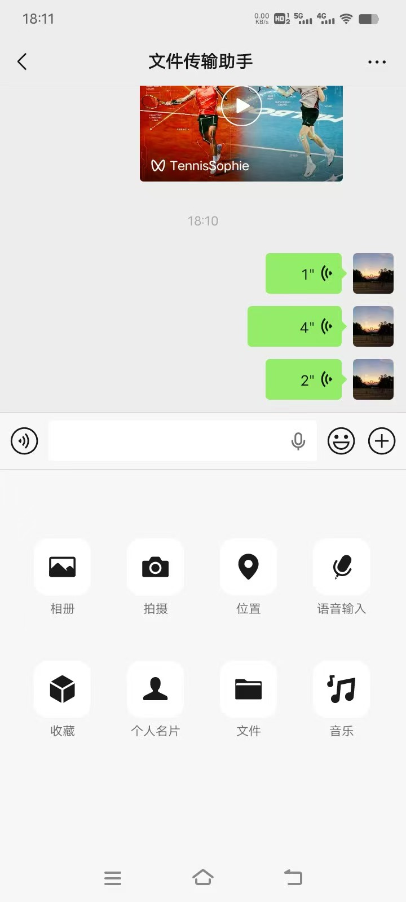

# Chatroom in Wechat on Android

Refer to https://docs.perryts.com/introduction.html, use `perryts` to create a chatroom app for Android.

## Layout of the chatroom

Reference to the above image:

- yellow box: message list
- the bottom box: five red boxes for message input
  - 1: voice message input
  - 2: text message input
  - 3: voice to text input
  - 4: emoji input
  - 5: plus message input

## Text message input

When the text message input box gets focus, the built-in input method editor appears. The user can start typing the text message or hand-write the text message.

If the text message input box is not empty, the user can click the `Send` button to send the text message.

## Voice message input

When the user clicks the voice message input box, `Hold and Speak` button appears. The user can hold the button to record the voice message. The voice message will be sent and listed in the message list.

See the video below:

<video width="640" height="360" controls>
 <source src="../images/06.mp4" type="video/mp4">
 Your browser does not support the video tag
</video>

## Voice to text input

When the user clicks the voice to text input box, the voice recognizer appears. The user can speak the text message and the recognizer will convert it to text. The text will be displayed in the input box.

## Emoji input

When the user clicks the emoji input box, the emoji picker appears. The user can select the emoji and it will be inserted in the input box.

## Plus message input

When the user clicks the plus message input box, the plus message picker appears. The user can select the plus message and it will be sent and listed in the message list.
